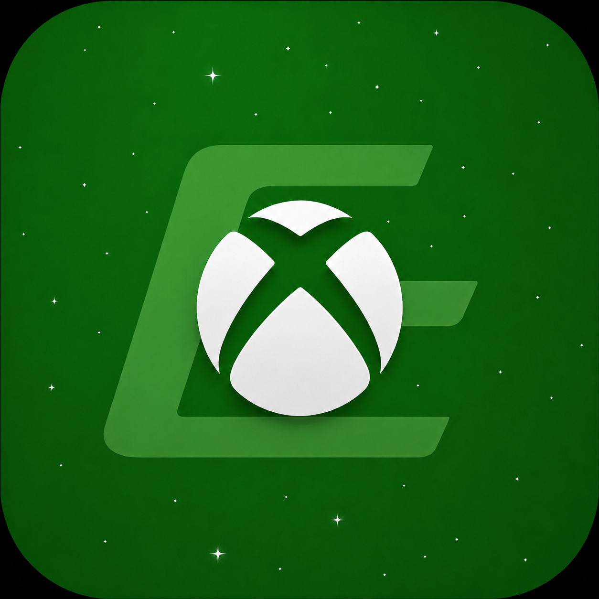

# EraEmu

<p align="center">
  
</p>

**EraEmu** is an experimental multiplatform **Xbox One emulator** written in **C++**.

The emulator currently supports **Windows x64**. Support for **Linux**, **macOS**, and **Android** is planned for the future.

> [!WARNING]
> EraEmu is still in an early stage of development. Compatibility is limited and games should not be expected to be fully playable yet.

## Info

EraEmu is a research and development project focused on running Xbox One software outside the original hardware.

The current Windows x64 version uses native x86-64 execution and includes early support for the main systems required by Xbox One games.

Current work includes:

- Loading extracted Xbox One games
- Reading `AppxManifest.xml` and game metadata
- Loading Xbox One x86-64 executables
- Native x86-64 guest execution on Windows x64
- Partial Kernel, CRT and WinRT HLE
- Early Xbox One system and input support
- Experimental D3D11X to Vulkan graphics
- Basic audio support
- SDL3 window and input handling

Many parts are still incomplete and will continue to change as development progresses.

## Games Tested

| Game | Status |
|---|---|
| **Sonic Mania** | **Experimental / Testing** |

Sonic Mania is currently the main game used to test and improve the emulator. It is not considered fully playable yet.

## Platform Support

- **Windows x64** — currently supported
- **Linux** — planned
- **macOS** — planned
- **Android ARM64** — planned

Linux, macOS and Android support will be added as the emulator becomes more portable and additional CPU backends are developed.

## Using EraEmu

EraEmu currently expects an already extracted Xbox One game directory.

The game folder should contain `AppxManifest.xml` directly or inside a `Mount` folder.

Run EraEmu from the command line:

```powershell
EraEmu.exe "C:\path\to\game"
```

Example:

```powershell
EraEmu.exe "D:\XboxOne\SonicMania"
```

You can also use:

```powershell
EraEmu.exe --gui "D:\XboxOne\SonicMania"
```

The `--gui` option opens the additional log window on Windows.

> [!IMPORTANT]
> EraEmu does not provide Xbox One games, keys, system files, or copyrighted game data.
> Use legally obtained dumps from hardware and software you own.

## Building

### Requirements

- Windows x64
- Visual Studio 2022 with C++ support
- CMake 3.24 or newer
- Git
- Perl
- A Vulkan-capable GPU with an up-to-date driver

Clone the repository and initialize the submodules:

```powershell
git submodule update --init --recursive
```

Configure and build with Visual Studio 2022:

```powershell
cmake -S . -B build -G "Visual Studio 17 2022" -A x64
cmake --build build --config Release --parallel
```

The executable will normally be generated at:

```text
build/src/Release/EraEmu.exe
```

## References

The following projects have been useful references during EraEmu development:

### shadPS4

[shadPS4](https://github.com/shadps4-emu/shadps4) helped as a reference for native x86-64 execution, multiplatform architecture, memory handling, and CPU backend design.

### WinDurango

[WinDurango](https://github.com/WinDurango/WinDurango) has been an important reference for studying Xbox One native code, Xbox-specific Windows/WinRT behavior, ABI details, and D3D11X.

EraEmu is an independent project and is not affiliated with either project.

## Disclaimer

EraEmu is an experimental emulator intended for research, development, and preservation-related purposes.

The project is not affiliated with, authorized by, sponsored by, or endorsed by Microsoft or Xbox.

## License

EraEmu is licensed under **GPL-2.0-or-later**. See [`LICENSE`](./LICENSE) for details.


